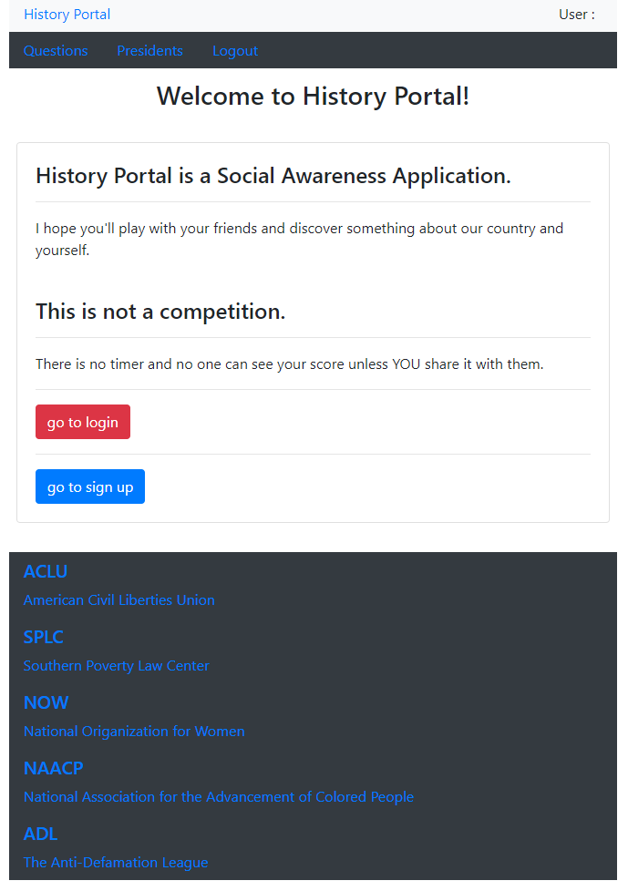

# Final Project - History Portal

[](http://stephonautery.com) [](https://opensource.org/licenses/MIT) [](http://www.ecma-international.org/ecma-262/6.0/) [](https://www.npmjs.com/package/path) [](https://www.npmjs.com/package/fs-extra) [](https://www.mongodb.com/company) [](https://www.npmjs.com/package/console.table) [](https://www.npmjs.com/package/console.table) [](https://www.npmjs.com/package/console.table)

History Portal is a MongoDB/React/Express/Node.js game app.

## site picture



## code snippet

This is a REACT application. Below is JSX code that handles the submission of a key form in the application.

```javaScript

    handleFormSubmit() {
        //get the answer
        if (this.state.selectedOption) {
            if (this.state.question.answer === this.state.selectedOption || this.state.question.answer === 'all') {
                // if they get it right
                this.setState({
                    numRight: this.state.numRight + 1,
                    answerResult: this.state.answerResult.concat('right'),
                    selectedOption: ''
                });
            } else {
                // if they get it wrong
                this.setState({
                    numWrong: this.state.numWrong + 1,
                    answerResult: this.state.answerResult.concat('wrong'),
                    selectedOption: ''
                });
            }
            // if all the questions are answered, redirect to the stats page
            if (this.state.questionNum === this.state.questions.length) {
                this.setState({
                    redirect: "/mystats"
                });
            } else {
                this.setQuestion();
            }
        }
    }

```

## dependencies

MongoDB\
Express\
React\
Node.js

### [History Portal on GitHub](https://github.com/StephonAutery/final-project)

### [History Portal deployed site](https://history-portal.herokuapp.com/login)

## contributors

- Stephon Autery

## Stephon Autery


[Stephon Autery on GitHub](https://github.com/StephonAutery)

[Stephon Autery on LinkedIn](https://www.linkedin.com/in/stephon-a-1bb575198/)
